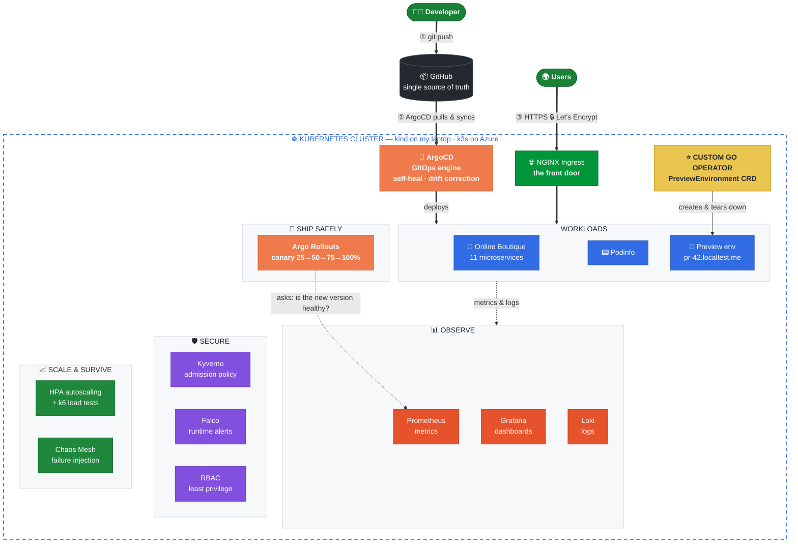
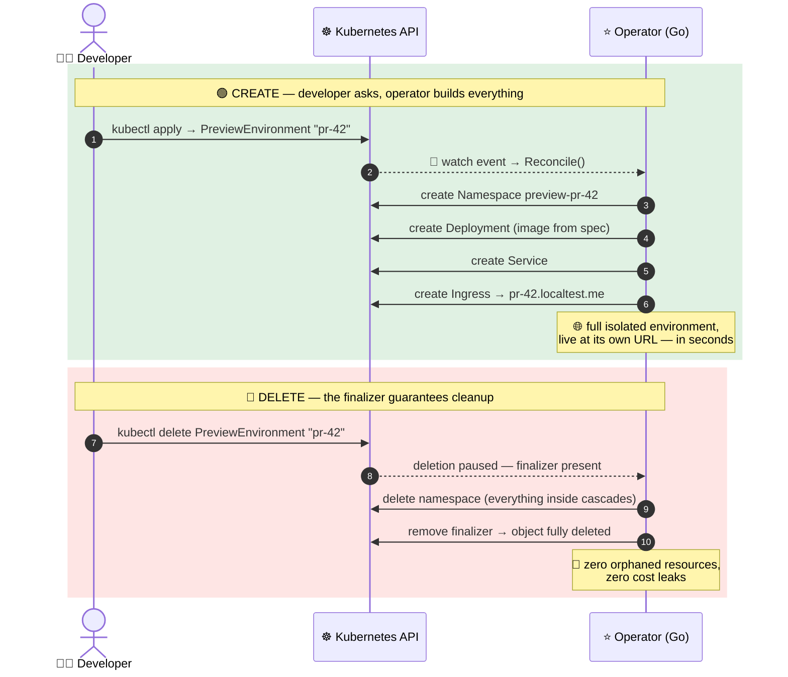
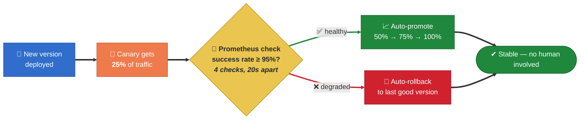
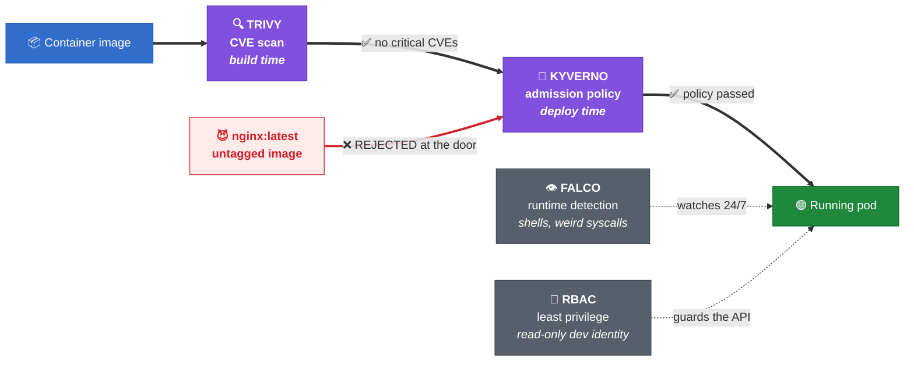

<div align="center">

# ☸️ Internal Developer Platform on Kubernetes

### The platform *around* the app — not just another deployed app.

**GitOps delivery · self-driving canary releases · full observability · layered security ·<br/>chaos-tested resilience · and a custom Kubernetes Operator written in Go.**

<br/>

[**🌍 Live Demo**](https://ayush-idp.duckdns.org) · [**🎥 Video Walkthrough**](https://drive.google.com/file/d/14-x45ra9iRBMOevZ0CqfLridM_HQqiSa/view?usp=sharing)

*(live demo runs on an Azure k3s cluster with real Let's Encrypt TLS — the VM is stopped when idle to control cost; happy to bring it up on request)*

<br/>


</div>

---

## 💡 The idea

Most Kubernetes projects stop at *"I deployed an app."*

This project is everything a real company builds **around** the app — the internal platform that lets a whole team ship safely: automated deployment from Git, releases that judge themselves against live metrics, centralized monitoring and logging, policy enforcement at the cluster door, autoscaling proven under real load, and on-demand preview environments powered by an operator I wrote myself.

To prove the platform is **app-agnostic**, it runs two completely unrelated workloads with zero platform changes:

| Workload | What it is | Why it's here |
|---|---|---|
| 🛒 **Online Boutique** | Google's 11-service polyglot microservices demo | A realistic, non-trivial app *I deliberately didn't write* — in platform engineering, the app is the workload; **the platform is the project** |
| 📟 **Podinfo** | A tiny Go web service | Proof that a second, unrelated app onboards with no platform changes |

---

## 🏗️ Architecture



**Same manifests run locally (kind) and in the cloud (k3s on Azure)** — only the host changes. That's the point of declarative infrastructure.

---

## ⚡ What it does

| Layer | Capability | Tools |
|---|---|---|
| **Run** | Runs any containerized microservice app | Kubernetes (kind / k3s) |
| **Deploy** | `git push` → auto-deploy, drift correction, self-heal | **ArgoCD** (GitOps) |
| **Release** | Canary rollouts with **metric-driven auto-rollback** | **Argo Rollouts** + Prometheus analysis |
| **Observe** | Live metrics, dashboards, centralized logs | **Prometheus · Grafana · Loki** |
| **Secure** | Image scanning · admission policy · runtime detection · least privilege | **Trivy · Kyverno · Falco · RBAC** |
| **Scale** | Autoscales under load, proven with load tests | **HPA** + **k6** |
| **Survive** | Chaos experiments prove self-healing | **Chaos Mesh** |
| **Self-service** ⭐ | On-demand ephemeral preview environments | **Custom Operator (Go / Kubebuilder)** |
| **Go live** | Public HTTPS on a cloud cluster | **Azure · k3s · cert-manager · Let's Encrypt** |

---

## ⭐ The standout: a custom Kubernetes Operator

I extended the Kubernetes API with my own resource type — and wrote the Go controller that reconciles it.

**A developer writes 7 lines:**

```yaml
apiVersion: platform.myproject.io/v1
kind: PreviewEnvironment
metadata:
  name: pr-42
spec:
  prNumber: 42
  image: nginx:1.27
```

**…and the operator does the rest:**



This is the **same reconciliation pattern Kubernetes itself is built on** — a declared desired state, and a control loop that makes reality match it. Idempotent reconcile, finalizer-based cleanup, least-privilege RBAC generated from Kubebuilder markers.

> The real-world use case: every pull request gets its own isolated, disposable copy of the app at its own URL — the feature you know from Vercel/Netlify previews, built here on raw Kubernetes.

📁 [`operator/`](operator/) · 📖 [`operator/README.md`](operator/README.md)

---

## 🚀 Releases that judge themselves

New versions don't ship all at once — and no human decides whether they're healthy. **Prometheus does.**



Two independent safety nets:
- **Metric gate** — an `AnalysisTemplate` runs a live PromQL query (non-5xx ÷ total requests) against real traffic; one failed check aborts and rolls back
- **Health gate** — `progressDeadlineAbort` + readiness probes catch versions that never even become healthy

📁 [`apps/podinfo-canary/`](apps/podinfo-canary/)

---

## 🛡️ Security: defense in depth

Four layers, at four different stages of a container's life — no single control has to be perfect, because there's another one behind it.



The Kyverno policy is enforced live — `kubectl run test --image=nginx` (untagged → `:latest`) is **rejected at admission** and never reaches the cluster.

📁 [`security/`](security/)

---

## 📈 Proven, not assumed

Claims are cheap. Every resilience property here is **demonstrated**:

- **Autoscaling** — a k6 load test ramps 100 virtual users against the shop; the HPA scales the frontend from 1 → 10 pods as CPU crosses the 50% target, then scales back down after the stabilization window. Watched live.
- **Self-healing** — Chaos Mesh kills the frontend pod on purpose; Kubernetes schedules a replacement in seconds while the Service keeps routing to healthy pods.
- **Slow-dependency chaos** — injected 2s network latency (the failure mode far more common than a clean crash) to observe degradation behaviour.
- **Disaster recovery** — when my local cluster's certificates corrupted, I rebuilt the *entire* platform in minutes with one script. Cattle, not pets.

📁 [`loadtest/`](loadtest/) · [`chaos/`](chaos/)

---

## 🔥 Debugging war stories (the part tutorials skip)

Real things that broke while building this — and how I fixed them:

| Incident | Root cause | Fix |
|---|---|---|
| **Grafana crash-looping, 432 restarts** | Two datasources (Prometheus + Loki) both provisioned with `isDefault: true` — Grafana refuses to start | Read the container logs → found the provisioning error → patched the Loki ConfigMap to `isDefault: false` |
| **Entire local cluster unreachable** (`x509: certificate signed by unknown authority`) | kind pins the node IP; Docker network changed it after a reboot | Rebuilt the whole platform from `setup.sh` in minutes — the recovery story that proves reproducibility |
| **ArgoCD install failed** (`metadata.annotations: Too long`) | Huge CRDs exceed the annotation limit used by client-side apply | `kubectl apply --server-side` |
| **Canary analysis inconclusive** | Deployed before Prometheus had scraped any traffic — `rate(...[1m])` over no data | Generate load first, wait a scrape cycle, then roll out |

> Every one of these taught me more than the happy path did. **Read the logs, don't guess.**

---

## 🖥️ Quick start — one command

```bash
bash setup.sh
```

Provisions the entire platform from scratch: kind cluster → ingress-nginx → metrics-server → ArgoCD → all apps (via GitOps) → Prometheus + Grafana → Loki → Kyverno → Falco → Chaos Mesh.

Then start the operator:

```bash
cd operator && make install && make run
```

---

## 📁 Repository structure

```
├── infra/kind-config.yaml      # local cluster, as code
├── apps/
│   ├── online-boutique/        # 11-service demo workload + HPA
│   ├── podinfo/                # 2nd app — proves the platform is app-agnostic
│   ├── podinfo-canary/         # automated canary + Prometheus analysis
│   └── hello/                  # minimal reference app
├── bootstrap/                  # ArgoCD Applications (GitOps, as code)
├── operator/                   # ⭐ custom Kubernetes Operator (Go / Kubebuilder)
├── security/                   # Kyverno policies + RBAC
├── chaos/                      # Chaos Mesh experiments
├── loadtest/                   # k6 load tests
└── setup.sh                    # one-command platform bootstrap
```

---

## ☁️ Cloud deployment

The platform also runs on a **k3s cluster on an Azure VM**, behind a real domain, with **automatic Let's Encrypt TLS** via cert-manager (ACME HTTP-01). Same manifests as local — only the ingress host changes.

🌍 **https://ayush-idp.duckdns.org**

---

## 🎓 Key concepts demonstrated

**Kubernetes** — Deployments · ReplicaSets · Services · Ingress · namespaces · RBAC & ServiceAccounts · CRDs & controllers · reconciliation loops · finalizers · readiness probes · resource requests & limits · HPA

**Platform engineering** — GitOps · progressive delivery · observability (metrics + logs) · policy-as-code · admission control · chaos engineering · load testing · reproducible infrastructure · TLS automation · cost-aware cloud operations

---

## 🧭 What this is — and isn't

**This is a portfolio platform, not a production system with real users** — and I think saying that clearly matters.

What it *is*: an end-to-end platform I designed, wired, broke, and fixed myself. Every tool is here for a reason I can defend, every capability is demonstrated live rather than claimed, and the whole thing rebuilds from scratch with one script.

---

<div align="center">
<sub>Built as a deep dive into platform engineering — every component built and understood from first principles.<br/>
<b>Ayush Bansal</b> · <a href="https://github.com/Ayush-Bansal08">GitHub</a> · <a href="https://ayush-idp.duckdns.org">Live demo</a></sub>
</div>
